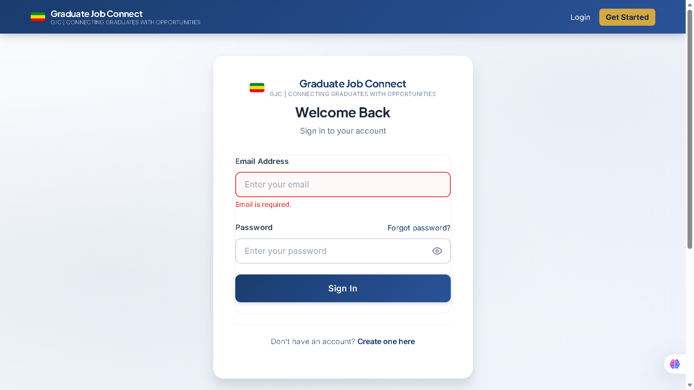
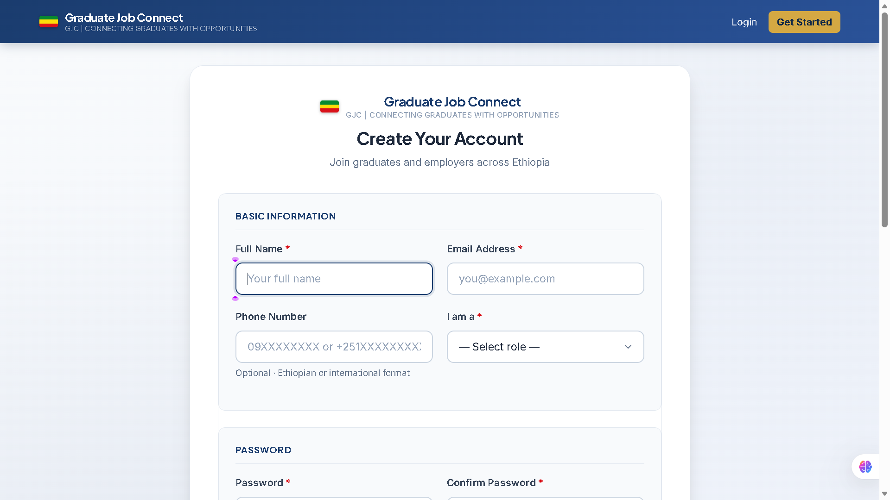

# Graduate Job Connect (GJC)

### Connecting Graduates with Opportunities

[](https://php.net)
[](https://mysql.com)
[](LICENSE)
[](tests/)
[](.github/workflows/php-tests.yml)

> A full-stack recruitment platform independently developed as a Computer Science portfolio project. Connects Ethiopian university graduates with employers through a complete job application and applicant tracking workflow.

---

## Screenshots

> **Note:** Replace the placeholder paths below with real screenshots after capturing them from the running application.

### Screenshots

### Landing Page


### Login Page



### Graduate Registration



### Graduate Dashboard


### Employer Dashboard


### Admin Dashboard


---

## Overview

Graduate Job Connect (GJC) is a recruitment platform built to bridge the gap between university graduates and employers. Graduates can search and apply for jobs, upload CVs, and track their applications in real time. Employers can post vacancies, manage applicants through a structured hiring workflow, and view analytics on their postings. Administrators have full oversight of users, jobs, and platform activity.

The project was independently developed to demonstrate practical software engineering — MVC architecture, secure authentication, role-based access control, database engineering, and a production-quality front end — without relying on any framework.

---

## Features

### Graduate Portal
- Profile management with CV upload (PDF, MIME-validated)
- Multi-dimensional job search — keyword, location, category, job type, work type, experience level
- Save and unsave jobs with AJAX toggle
- Apply with cover letter
- Real-time application status tracking
- Application withdrawal
- In-app notifications with unread badge

### Employer Portal
- Company profile with logo upload
- Full job posting form — salary range, deadline, work mode, experience level
- Applicant Tracking System: Pending → Shortlisted → Accepted / Rejected
- Bulk application actions
- 14-day application trend chart (Chart.js)
- Application status doughnut chart

### Admin Panel
- User management — search, filter, activate/deactivate, bulk delete
- Job management — search, filter, toggle status, bulk actions
- 30-day registration trend line chart
- Platform-wide statistics

### Security
- bcrypt password hashing (cost 12)
- CSRF token on every state-changing form — verified server-side, rotated after use
- Session regeneration on login (prevents session fixation)
- RBAC enforced by `AuthMiddleware` on every protected page
- Rate limiting on login and registration
- File uploads validated via `finfo` (not client-supplied MIME type)
- PHP execution blocked in all upload directories via `.htaccess`

---

## Architecture

```
Browser
  ↓
Page file  (thin — auth guard, calls controller, renders HTML)
  ↓
Controller  (input sanitization, CSRF verification, orchestrates services)
  ↓
Service     (business logic, validation rules)
  ↓
Model       (database queries only — no SQL in views or controllers)
  ↓
MySQL
```

Custom PSR-4 autoloader in `config/bootstrap.php` — no framework required at runtime.  
Composer is used only for development dependencies (PHPUnit).

See [docs/architecture.md](docs/architecture.md) for the full architecture and security threat model.

---

## Project Structure

```
Graduate-Job-Connect/
├── app/
│   ├── Controllers/       AuthController, JobController, ProfileController
│   ├── Models/            UserModel, JobModel, ApplicationModel, + 5 more
│   ├── Services/          AuthService, JobService, ApplicationService, FileUploadService
│   ├── Middleware/        AuthMiddleware  (CSRF, RBAC)
│   └── Helpers/           ViewHelper  (output escaping, pagination, badges)
├── config/
│   ├── bootstrap.php      PSR-4 autoloader + PDO singleton + session
│   └── environment.php    .env loader + constants
├── database/
│   ├── migrations/        001_initial_schema.sql, 002_upgrade_v2.sql
│   └── seeders/           001_demo_data.sql
├── admin/                 Dashboard, user management, job management
├── employer/              Dashboard, job posting, applicant tracking
├── graduate/              Dashboard, job search, applications, profile
├── routes/                api.php  (REST API scaffold)
├── assets/                style.css (1 500+ line design system), script.js
├── uploads/               cv/, logos/, avatars/  (PHP execution blocked)
├── tests/                 AuthServiceTest (13), JobServiceTest (9)
├── docs/                  architecture.md, database-design.md, api-documentation.md
├── .github/               workflows/php-tests.yml, issue templates
├── .env.example
├── composer.json
└── phpunit.xml
```

---

## Technology Stack

| Layer | Technology |
|---|---|
| Backend | PHP 8.2 |
| Database | MySQL 8.0+ |
| Database access | PDO with prepared statements |
| Frontend | HTML5, CSS3, JavaScript |
| Charts | Chart.js 4.4 |
| Testing | PHPUnit 10 (22 test cases, SQLite in-memory) |
| CI | GitHub Actions |
| Development | XAMPP |

---

## Database Design

### Core Tables

| Table | Purpose |
|---|---|
| `users` | Auth — name, email, bcrypt password, role, status |
| `graduate_profiles` | CV, skills, university, bio, links |
| `employer_profiles` | Company info, industry, logo |
| `jobs` | Full spec — salary range, deadline, work type, status |
| `applications` | ATS pipeline — cover letter, status workflow |
| `saved_jobs` | Graduate bookmarks |
| `notifications` | Real-time user alerts |
| `activity_logs` | Audit trail |
| `password_resets` | Token-based password recovery |

### Application Status Workflow

```
Applied (pending)
    ↓
Shortlisted ⭐
    ↓
Accepted  or  Rejected

Graduate can withdraw before acceptance.
Duplicate applications blocked by DB UNIQUE constraint.
```

See [docs/database-design.md](docs/database-design.md).

---

## Installation

### Requirements
- PHP 8.1+
- MySQL 8.0+
- XAMPP (Apache + MySQL)

### Steps

```bash
# 1. Clone into htdocs
git clone https://github.com/tedrosweldegebriel465-eng/job-portal-management-system.git "Graduate Job Connect"
cd "Graduate Job Connect"

# 2. Configure environment
cp .env.example .env
# Edit .env — set DB_HOST, DB_NAME, DB_USER, DB_PASS

# 3. Install dev dependencies (PHPUnit only)
composer install --dev
```

**4. Set up the database**

Open phpMyAdmin, create a database named `job_portal`, then import in this order:

```
database/migrations/001_initial_schema.sql
database/seeders/001_demo_data.sql
```

If upgrading an existing database (e.g. from an older schema):

```
http://localhost/Graduate%20Job%20Connect/run_migration.php
```

Delete `run_migration.php` after running it.

**5. Start XAMPP** → Apache + MySQL, then open:

```
http://localhost/Graduate%20Job%20Connect/
```

**6. Verify installation**

```
http://localhost/Graduate%20Job%20Connect/test_database.php
```

All health checks should pass.

---

## Demo Accounts

| Role | Email | Password |
|---|---|---|
| Admin | admin@jobportal.com | password |
| Employer | employer@test.com | password |
| Graduate | graduate@test.com | password |

> Change all demo passwords before any production use.

---

## Testing

```bash
composer test
```

Tests run against **SQLite in-memory** — no MySQL required.

| Test File | Cases | What It Covers |
|---|---|---|
| `AuthServiceTest` | 13 | Registration, login, password rules, validation edge cases |
| `JobServiceTest` | 9 | Job creation, salary validation, deadline, job type |

---

## API

A functional REST API scaffold is in `routes/api.php`.

```
POST /routes/api.php?resource=auth&action=login
GET  /routes/api.php?resource=jobs
GET  /routes/api.php?resource=jobs&id={id}
POST /routes/api.php?resource=jobs
GET  /routes/api.php?resource=applications
POST /routes/api.php?resource=applications
PUT  /routes/api.php?resource=applications&id={id}
```

All responses: `{ "success": bool, "data": ..., "error": ... }`

URL routing and a formal router are planned. See [docs/api-documentation.md](docs/api-documentation.md).

---

## Roadmap

- [x] MVC-style architecture with service layer
- [x] Secure authentication (bcrypt, session hardening, rate limiting)
- [x] Role-based access control — enforced server-side
- [x] CSRF protection on all state-changing operations
- [x] Multi-dimensional job search with pagination
- [x] Applicant Tracking System workflow
- [x] Chart.js analytics dashboards
- [x] Notifications system
- [x] Password reset flow (forgot/reset)
- [x] PHPUnit test suite (22 cases)
- [x] REST API scaffold
- [x] GitHub Actions CI
- [x] Database migrations
- [ ] Email notifications via SMTP (PHPMailer)
- [ ] Admin-controlled OTP verification for new accounts
- [ ] AI-powered job matching (Python microservice)
- [ ] Formal URL router

---

## Documentation

| Document | Description |
|---|---|
| [docs/architecture.md](docs/architecture.md) | System architecture, security model |
| [docs/database-design.md](docs/database-design.md) | Table definitions, indexes, triggers |
| [docs/api-documentation.md](docs/api-documentation.md) | REST API reference |
| [SECURITY.md](SECURITY.md) | Vulnerability reporting |
| [CONTRIBUTING.md](CONTRIBUTING.md) | Development workflow |
| [CHANGELOG.md](CHANGELOG.md) | Version history |

---

## Engineering Highlights

- **No framework at runtime** — custom PSR-4 autoloader handles class resolution; Composer is dev-only
- **Clean layer separation** — zero SQL in views, zero HTML in models; all business logic in service classes
- **Defensive model layer** — every model uses `try/catch` and detects missing columns/tables at runtime, so the application degrades gracefully against a partially migrated schema
- **SQL injection prevention** — every database interaction uses PDO prepared statements; no string-concatenated queries anywhere
- **CSRF token rotation** — token is regenerated after each verified POST, not just per session
- **Secure file handling** — `finfo_file()` for MIME detection, randomised filenames, upload directories protected by `.htaccess`

---

## Author

**Tedros Weldegebriel**  
Computer Science Student

- GitHub: [tedrosweldegebriel465-eng](https://github.com/tedrosweldegebriel465-eng)
- Email: tedrosweldegebriel465@gmail.com

---

## License

MIT — see [LICENSE](LICENSE).

---

*Graduate Job Connect (GJC) — Connecting Graduates with Opportunities*
